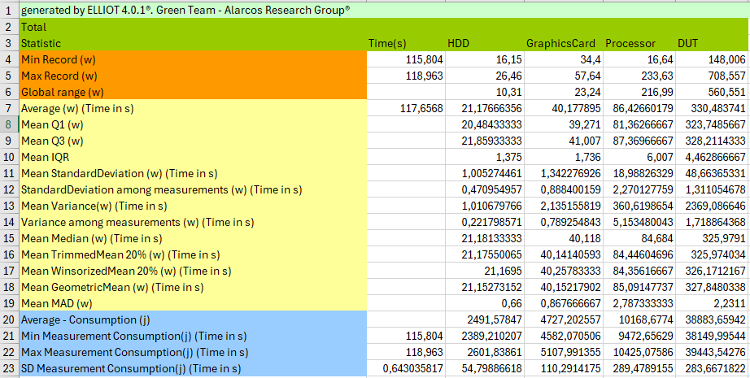

# Does the programming language translator version influence the energy consumption of programming languages?

[Elisa Jimenez](https://orcid.org/0000-0002-2158-037X)  

[Alberto Gordillo](https://orcid.org/0000-0002-4742-173X)  

[Coral Calero](https://orcid.org/0000-0003-0728-4176)

[Mª Ángeles Moraga](https://orcid.org/0000-0001-9165-7144)

[Félix García](https://orcid.org/0000-0001-6460-0353)


## Abstract
Today, software plays a crucial role in our daily activities. Virtually all the technology we use contains software
components written in a particular programming language. In this context, programming language translators play an
important role, as they are needed to convert the software source code, written by professional software developers,
into a format that can be executed by a machine. The significant influence of the programming language on the energy
consumption of the resulting programs has been highlighted in some research. However, there have been no studies on
the impact of the programming language translator version of the programming language on the energy consumption.
This paper presents a first approach to fill this gap by investigating the impact of programming language translator
versions on the energy consumption of programs written in Python, C and Java. We measured the energy consumed
by eight algorithms written in the three languages and run with different programming language translator versions.
Surprisingly, the results show no noticeable trend of improvement between versions within each language. These
results seem to indicate that energy efficiency is not among the aspects considered to evolve programming language
translators.

## What is this?

This repository contains the source code of 8 algorithms implemented in 3 programming languages (Java, C and Python), which were obtained from [Computer Language Benchmark Game](https://benchmarksgame-team.pages.debian.net/benchmarksgame/).
The repository also includes the resulting empirical results and some samples of the energy records obtained from the hardware measurement instrument used in the study.


## How is structured?

This folder contains three main folders: code, empirical results and sample logs.

## Code Folder

The code folder contains 17 subfolders, one for each PLT (Programming Language Translator).  Its structure is as follows:
```Java

| <PTL-1>
	| <algorithm-1>
		| <source>
		| Makefile
	| ...
	| <algorithm-i>
		| <source>
		| Makefile
| ...
| <PTL-i>
	| <algorithm-1>
	| ...
	| <algorithm-i>


```

Taking the `Java` PLT as an example, this is how the folder for the `binary-trees` algorithm would look like:

```Java

| Java8
	| binary-trees
		| binarytrees.gcc-3.c
		| Makefile
	| ...

```

#### The Operations

Each algorithm sub-folder, included in a programming language folder, contains a `Makefile`.
TThis is the file which shows how to perform the 2 main operations: *(1)* **compilation** and *(2)* **execution**.

Basically, each `Makefile` **must** contain 2 rules, one for each operations:

| Rule | Description |
| -------- | -------- |
| `compile` | This rule specifies how the algorithm should be compiled in the language under consideration; Interpreted languages do not need it, so it can be left blank in these cases.
| `run` | This rule specifies how the algorithm should be executed; It is used to test whether the algorithm runs with no errors and the output is the expected. 

To illustrate this, an example of the `Makefile` for the `binary-trees` algorithm in the `C` language is:

```Makefile
compile:
	/usr/bin/gcc -pipe -Wall -O3 -fomit-frame-pointer -march=native -fopenmp -D_FILE_OFFSET_BITS=64 -I/usr/include/apr-1.0 binarytrees.gcc-3.c -o binarytrees.gcc-3.gcc_run -lapr-1 -lgomp -lm

run:
	./binarytrees.gcc-3.gcc_run 21

```
## Empirical Results Folder

The empirical results folder includes all the information on the analysis of the energy consumption of the software. The basic terminology used is as follows:
- An entity class corresponds to a PLT. 
- The test case is an algorithm implemented in a determined PLT.
- Measurement is each of the executions of a testcase.

It is structured as follows:

```Java
|<report>
	| <EntityClass-1>@<Algorithm-1>.xls
	| ...
	| <EntityClass-i>@<Algorithm-i>.xls
	| testcases_total.xls
	| testcases_averages_comparison.xls
	| versions_total.xls
	| versions_averages__comparison.xls
	| 
		| <EntityClass-1>@<Algorithm>_<Device-1>.png
		| ...
		| <EntityClass-i>@<Algorithm>_<Device-i>.png
		|
		| <EntityClass-1>@<Algorithm>_dut-1.png
		| ...
		| <EntityClass-i>@<Algorithm>_dut-i.png

| coorelations.pdf
| ScatterGraph_of_time_and_consumption.pdf
| testcases_averages_comparison.xls
| testcases_total.xls
| testcases_spearman.xls
| versions_averages__comparison.xls
| versions_total.xls
| versions_spearman.xls

```
### Report Folder
The report folder contains 225 Excel files containing the analysis data. One for each test case named `<EntityClass>@<Algorithm>`. It also contains two files "testcases_total" and "versions_total" with the summary of the test case and version information respectively.
As an example, the following images show the information of a test case.

The first image shows all the information of a measurement.


The second image shows all the information of a test case.


To facilitate the comparison of information, the file "testcases_total" contains one sheet for each statistical value of all test cases. These statistical values are:
Consumption average without baseline, Consumption median without baseline, Consumption average (with baseline), Consumption median (with baseline), Baseline, Power min, Power average without baseline, Power average (with baseline), Power median without baseline, Power median (with baseline), Trimmed mean to 20%, Winsorized mean to 20%, Geometric mean, Mean standard deviation, Mean variance, Standard deviation among measurments and Variance among measurments


In the same way as the "testcase_total" document, the "versions_total" document contains the statistical values for each Entity Class.


Finally, the validation tests of the statistics can be found in testcases_comparison and versions-comparison. It contains the Kolmogorov-Smirnov and Mann-Whitney tests for all comparisons of time, power and consumption.


#### Img folder
#### Img folder
The img folder contains the graphs of the overall consumption in the execution of each measurement performed. It also includes the box plots of each device for each test case and for each version of PLT.

## Sample Logs Folder
This folder contains an example of a log, to illustrate the raw data generated by the EET measurement instrument. 
- The json file contains the measurement information of the entity class.
- Each line of 3RunC7_847_EX are the values obtained for id, time, monitor and DUT
- Each line of 3RunC7_847_IN are the values obtained for id, time, HDD(),HDD(2), Graphics card(1), Graphics card(2),Processor(1) and Processor(2).
DUT hardware components have two values because they have two sensors connected, the result of the DUT hardware component is the sum of the two values.

Note: The rest of the logs of this study are not included in the repository for practical reasons, due to their large size.

## Contacts and References

Previous study carried out by [Pereira et al., 2021]( https://states.github.io/files/j2.pdf)

[Green Team Alarcos](https://greenteamalarcos.uclm.es/)

[The Computer Language Benchmark Game](https://benchmarksgame-team.pages.debian.net/benchmarksgame/)

